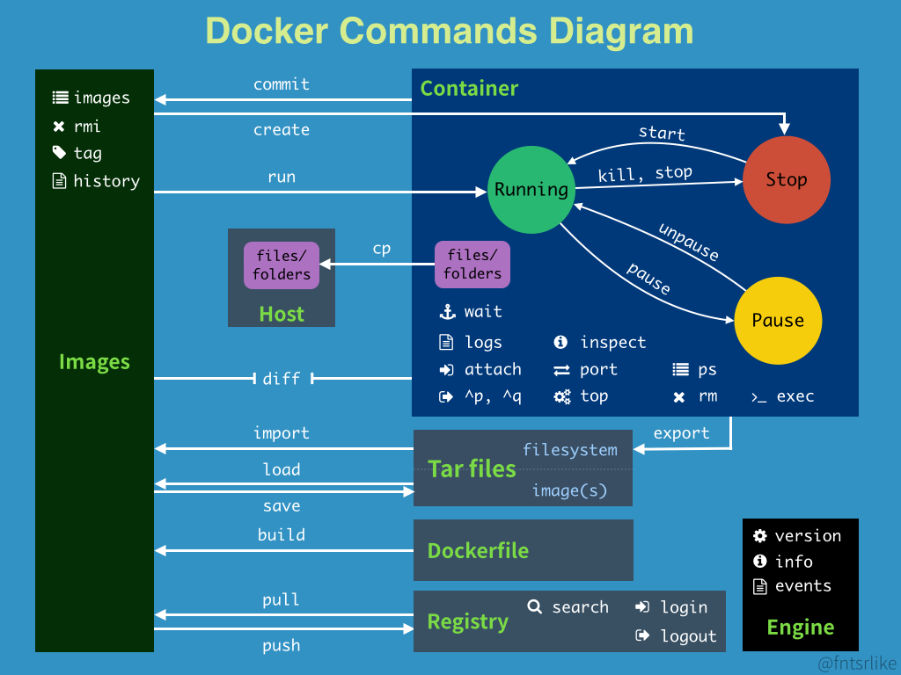
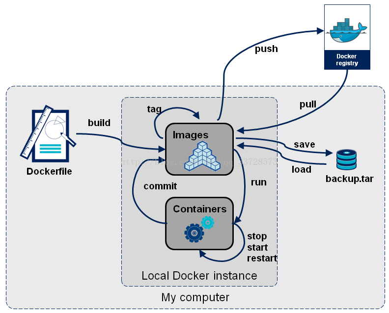
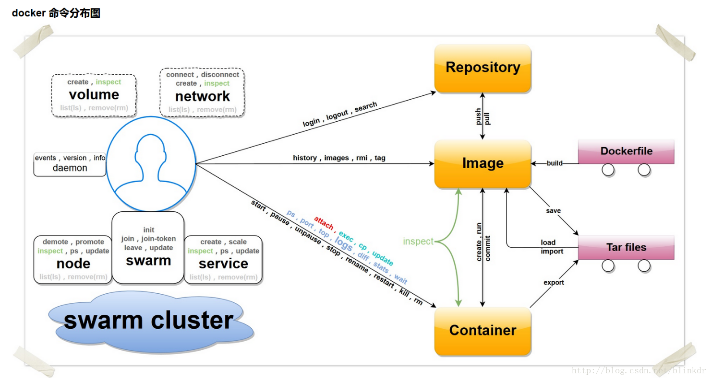

## Docker命令图谱

### 1.基本命令

#### 1.1仓库相关操作
docker pull    #从远程仓库拉取镜像到本地
docker push    #推送本地镜像到远程仓库
docker search  #在仓库搜索镜像
docker login    #登录到官方仓库Docker Hub
docker logout  #退出登录
#### 1.2镜像相关操作
docker build    #从Dockerfile构建镜像
docker pull    #同上
docker push    #同上
docker history  #显示镜像的历史信息
docker images  #列出镜像
docker rmi      #删除镜像
docker tag      #给镜像打上tag标签
docker run      #创建容器并启动容器
docker create  #创建容器
docker commit  #将修改后的容器生成镜像
docker load    #从压缩包中加载镜像
docker import  #
docker save    #将镜像保存到压缩文件
#### 1.3容器相关操作
docker attach  #依附到一个正在运行的容器中
docker exec    #进到正在运行的容器中执行命令
docker cp      #在容器和本地系统间复制文件
docker update  #将一个容器内所有的进程从暂停状态中恢复
docker ps      #列出主机中的容器
docker port    #查找一个nat到私有网口的公共口
docker top      #查看一个容器中正在运行的进程信息
docker logs    #查看日志文件
docker diff    #检查容器内文件系统的修改
docker status  #输出容器的资源使用统计信息
docker wait    #阻塞直到容器终止
docker start    #启动已创建的容器
docker pause    #暂停运行中的容器
docker unpause  #使暂停的容器恢复运行
docker stop    #停止容器运行
docker rename  #容器改名
docker restart  #容器重启
docker kill    #关闭运行中的容器
docker rm      #删除容器
docker export  #导出容器内容为tar包
docker run      #同上
docker create  #同上
docker commit  #同上

#### 1.4其他基本命令
docker events  #从服务端获取实时的事件
docker info    #查看系统相关信息
docker inspect  #显示Docker对象的具体配置信息，包括容器，镜像，网络等
docker version  #输出Docker的版本信息

### 2管理命令
docker container    #容器管理
docker image        #镜像管理
docker network      #网络管理
docker node        #节点管理
docker plugin      #插件管理
docker secret      #
docker service      #服务管理
docker stack        #
docker swarm        #集群管理
docker system      #
docker volume      #卷管理

(Tobecontinue)

================================================================
Docker命令
docker 常用命令如下
管理命令：
  container  管理容器
  image      管理镜像
  network    管理网络
  node        管理Swarm节点
  plugin      管理插件
  secret      管理Docker secrets
  service    管理服务
  stack      管理Docker stacks
  swarm      管理Swarm集群
  system      查看系统信息
  volume      管理卷


  如：docker container ls 显示所有容器


普通命令：


  attach    进入一个运行的容器
  build      从一个DockerFile构建镜像
commit从容器创建一个镜像
  cp          从容器和主机文件系统之间拷贝文件
create创建一个容器
  diff        检查容器文件系统上的更改
events从服务器获取实时事件
  exec        在正在运行的容器中运行命令
export将容器的文件系统导出为tar存档
  history    显示镜像的历史记录
  images      查看镜像列表
import从归档文件中创建镜像
  info        显示系统范围的信息
  inspect    返回Docker对象的低级信息
killkill运行中的容器
load从存档或者STDIN加载镜像
  login      登陆docker镜像仓库
  logout      退出docker镜像仓库
logs获取一个容器的日志
  pause      暂停一个或多个容器中的所有进程
  port        查看端口映射或容器的特定映射列表
  ps          查看容器列表
  pull        从镜像仓库拉取镜像
  push        将本地的镜像上传到镜像仓库,要先登陆到镜像仓库
rename重命名容器
  restart    重启容器
  rm          删除容器
  rmi        删除镜像
  run        创建一个新的容器并运行一个命令
save将指定镜像保存成 tar 归档文件
search从Docker Hub搜索镜像
start启动容器
  stats      实时显示容器资源使用情况的统计信息
stop停止容器
  tag        标记本地镜像，将其归入某一仓库
  top        展示一个容器中运行的进程
  unpause    恢复容器中所有的进程
update更新容器配置
version显示Docker的版本信息
wait阻塞直到容器停止，然后打印退出代码


  如：docker images 显示所有镜像
下面将分别介绍一些常用操作
docker 拉取并运行一个镜像
下载镜像
$ docker pull centos
查看已经下载的镜像
$ docker images
    REPOSITORY          TAG                IMAGE ID            CREATED            SIZE
centos              latest49f7960eb7e46weeks ago200MB
hello-world        latest              f2a91732366c8months ago1.85kB
运行一个镜像并生成容器
//运行一个centos镜像，并执行/bin/bash命令
$ docker run centos /bin/bash
输入命令docker ps或者docker container ls查看运行中的容器，发现列表为空，原因是容器在执行完成命令后会自动退出，下面介绍让让容器停留在后台的方法
$ docker ps
    CONTAINER ID        IMAGE              COMMAND            CREATED            STATUS              PORTS              NAMES


$ docker container ls
    CONTAINER ID        IMAGE              COMMAND            CREATED            STATUS              PORTS              NAMES
使用命令docker ps -a或者docker container ls -a 查看所用容器,并显示了容器的状态
$ docker ps -a
CONTAINER ID        IMAGE              COMMAND            CREATED            STATUS                      PORTS              NAMES
5525373371f3        centos"/bin/bash"7minutes ago      Exited (0)7minutes ago                        nifty_rosalind
docker 让镜像运行停留在后台
1.启动一个容器并后台运行
docker run命令 通过增加-i -t参数可以让容器并进入容器
docker run -i -t centos /bin/bash
按 Ctrl + P + Q 退出容器，再用 docker ps 进行查看
$ docker ps
CONTAINER ID        IMAGE              COMMAND            CREATED            STATUS              PORTS              NAMES
61b041e4e063        centos"/bin/bash"3minutes ago      Up3minutes                            nervous_saha
状态显示仍在运行中
docker 进入一个运行的容器
$ docker ps
CONTAINER ID        IMAGE              COMMAND                  CREATED            STATUS              PORTS                    NAMES
36afde543eb5        mysql:5.7"docker-entrypoint.s…"About anhourago  Up About anhour0.0.0.0:3306->3306/tcp  mymysql
$ docker exec -it36afde543eb5 /bin/bash
-i 保持STDIN打开 -t 分配一个虚拟TTY窗口
docker 提交一个镜像到镜像仓库
首先到https://hub.docker.com/注册一个账号，保存下用户名密码 2.控制台登陆dockerhub账户
$ docker login
    输入刚注册的用户名密码
查看镜像
$ docker images
REPOSITORY          TAG                IMAGE ID            CREATED            SIZE
redis              latest              f06a5773f01e2days ago83.4MB
选择需要上传的镜像，重命名为指定的格式
$ docker  tag redis username/myredis:v1
username：为自己注册的用户名
myredis:为自己为镜像取的名字
v1：为任意设置的版本号
完成上述操作后，即可提交镜像到自己的仓库
docker pull username/myredis:v1
docker 映射文件从宿主机到容器,端口号映射
//将宿主机的81端口映射到容器的80端口
//将宿主机的/develop/data卷，映射到容器的/data卷
$ docker run -i -t -p81:80-v /develop/data:/datacentos /bin/bash
-p:映射端口号 -v:磁盘目录映射
docker 更改端口号映射
运行中的容器无法映射新的端口号，也无法更改端口号映射，但可以通过两种方法解决
iptable转发端口
//查看容器ip
$ docker inspect36afde543eb5 | grep IPAddress
"IPAddress":"172.17.0.2"
//将主机的8081端口映射到宿主机的8080端口
$ iptables -t nat -A  DOCKER -p tcp --dport8081-j DNAT --to-destination172.17.0.2:8080
先提交容器为镜像，再运行这个容器，同时指定新的端口映射
//提交容器为镜像
$ docker commit9995ffa15f46  mycentos:0.1
//停止旧的容器
$ docker stop9995ffa15f46
//重新从旧的镜像启动容器
$ docker run -i -t  -p8081:8080mycentos:0.1
从DockerFile创建镜像
$ docker build -tmyimage:v1 .
-t ：指定镜像名称和标签，格式为'name:tag' .: 最后一个点代表当前目录，也可以换成其它的路径

