# 如何使用Rancher创建Kubernetes集群并进行可视化多集群管理

## 介绍
Kubernetes是容器集群管理系统，是一个开源的平台，可以实现容器集群的自动化部署、自动扩缩容、维护等功能。

通过Kubernetes你可以：

快速部署应用
快速扩展应用
无缝对接新的应用功能
节省资源，优化硬件资源的使用
我们的目标是促进完善组件和工具的生态系统，以减轻应用程序在公有云或私有云中运行的负担。

### Kubernetes 特点
可移植: 支持公有云，私有云，混合云，多重云（multi-cloud）
可扩展: 模块化, 插件化, 可挂载, 可组合
自动化: 自动部署，自动重启，自动复制，自动伸缩/扩展
Kubernetes是Google 2014年创建管理的，是Google 10多年大规模容器管理技术Borg的开源版本。

### 常见的创建Kubernetes集群的方式有
* [使用Kubeadm创建Kubernetes集群](https://github.com/anypm/kubernetes-tutorials-series/blob/master/how-to-create-a-kubernetes-1-11-cluster-using-kubeadm-on-ubuntu-18-04.md)
* 使用Kubemini创建Kubernetes集群
* 使用RKE创建Kubernetes集群
* 使用Rancher创建Kubrnetes集群

本文主要讲述**如何使用Rancher创建Kubernetes集群并进行可视化的集群管理**。后续会陆续发布其他方式创建Kubernetes集群，并在本文中给出相关链接，请您持续关注

### Rancher创建与管理Kubernetes集群的主要优势

Rancher是一套容器管理平台，它可以帮助组织在生产环境中轻松快捷的部署和管理容器。 Rancher可以轻松地管理各种环境的Kubernetes，满足IT需求并为DevOps团队提供支持。

* 企业级容器管理平台
Rancher是业界唯一完全开源的企业级容器管理平台，为企业用户提供在生产环境中落地使用容器所需的一切功能与组件。Rancher2.0基于Kubernetes构建。使用Rancher，DevOps团队可以轻松测试、部署和管理应用程序，运维团队可以部署、管理和维护一切Kubernetes集群，无论集群运行在何基础设施之上。

* 多集群管理
Rancher可以更方便的管理Kubernetes集群，它可以从头开始轻松部署新集群，甚至可以导入现有的Kubernetes集群。

* 统一运营管理
对于Rancher，运营团队在开发，测试和生产Kubernetes集群中拥有相同的部署和管理工具。


## 目标
集群包含以下资源

* 1个Rancher节点：
* 1个Etcd节点：
* 1个控制(Controller)节点：
* 2个工作(Worker)节点：

完成本指南后您将学会**安装Docker环境**、**搭建Rancher集群管理环境**、**使用Rancher创建Kubernetes环境**和**使用Rancher进行多集群管理**。

> 注意：配置推荐至少2核CPU、4GB内存、40GB存储、2M带宽，系统均为Ubuntu 16.04 LTS。为达到更好的效果，本文创建的5台云服务器配置均为4核CPU、8GB内存、200GB存储、5M带宽，系统选择Ubuntu 16.04 LTS。


## 第一步：购买滴滴云服务器
登陆[滴滴云控制台](https://app.didiyun.com/#/auth/signin?channel=0&return_to=https%3A%2F%2Fwww.didiyun.com%2F)购买**5台**滴滴云服务器(如果需要完成试验后即删除可以购买按时长配置)，配置推荐至少2核CPU、4GB内存、40GB存储、2M带宽，系统均为Ubuntu 16.04 LTS。5台服务器作用如下：


登陆滴滴云批量创建云服务器，如下图：

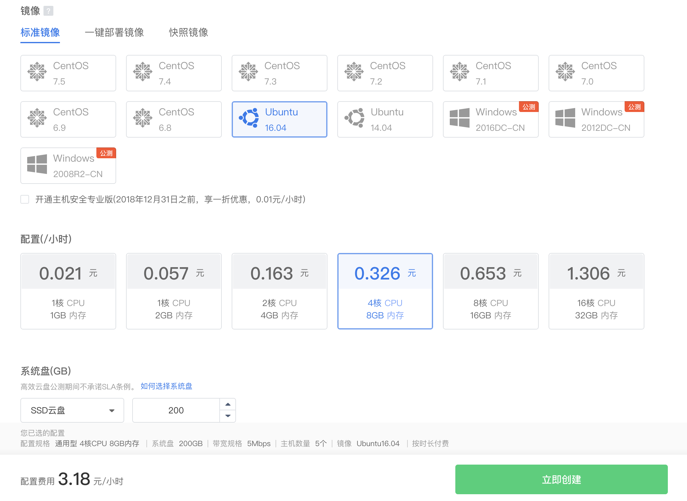

购买成功后DC2云服务器列表如下图：

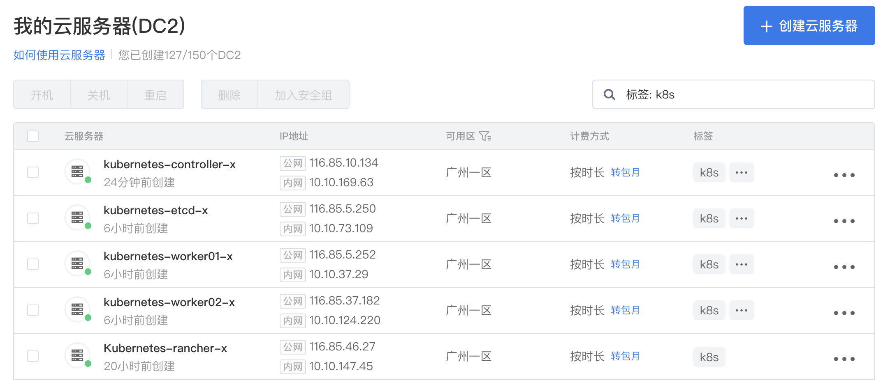


> 注意：为达到更好的效果，本文创建的5台云服务器配置均为4核CPU、8GB内存、200GB存储、5M带宽。

## 第二步：安装Docker
1. 检查内核版本：
```
$ uname -a
```
输出如下结果,内核版本符合要求(确保内核版本3.0以上)：
```
$ Linux 10-10-73-109 4.4.0-138-generic #164-Ubuntu SMP Tue Oct 2 17:16:02 UTC 2018 x86_64 x86_64 x86_64 GNU/Linux
```

2. 为了让Docker使用aufs存储，推荐安装如下两个软件包
```
$ sudo apt-get update
```
```
OUTPUT

Hit:1 http://mirrors.intra.didiyun.com/ubuntu xenial InRelease
Hit:2 http://mirrors.intra.didiyun.com/ubuntu xenial-updates InRelease
Hit:3 http://mirrors.intra.didiyun.com/ubuntu xenial-backports InRelease
Hit:4 http://mirrors.intra.didiyun.com/ubuntu xenial-security InRelease
Reading package lists... Done
```
```
$ sudo apt-get install -y \
linux-image-extra-$(uname -r) \
linux-image-extra-virtual
```
```
OUTPUT

Reading package lists... Done
Building dependency tree       
Reading state information... Done
The following additional packages will be installed:
  amd64-microcode crda intel-microcode iucode-tool iw libnl-3-200 libnl-genl-3-200 linux-firmware linux-image-4.4.0-140-generic linux-image-extra-4.4.0-140-generic linux-image-generic thermald wireless-regdb
Suggested packages:
  fdutils linux-doc-4.4.0 | linux-source-4.4.0 linux-tools linux-headers-4.4.0-140-generic
The following NEW packages will be installed:
  amd64-microcode crda intel-microcode iucode-tool iw libnl-3-200 libnl-genl-3-200 linux-firmware linux-image-4.4.0-140-generic linux-image-extra-4.4.0-138-generic linux-image-extra-4.4.0-140-generic
  linux-image-extra-virtual linux-image-generic thermald wireless-regdb
0 upgraded, 15 newly installed, 0 to remove and 17 not upgraded.
Need to get 147 MB of archives.
After this operation, 623 MB of additional disk space will be used.
...

```

3. 添加镜像源
* 安装apt-transport-https等软件包支持https协议的源
```
$ sudo apt-get install \
apt-transport-https \
ca-certificates \
curl \
software-properties-common
```
```
OUTPUT

Reading package lists... Done
Building dependency tree       
Reading state information... Done
apt-transport-https is already the newest version (1.2.29).
ca-certificates is already the newest version (20170717~16.04.1).
curl is already the newest version (7.47.0-1ubuntu2.11).
software-properties-common is already the newest version (0.96.20.7).
0 upgraded, 0 newly installed, 0 to remove and 17 not upgraded.
```

添加源的gpg密钥
```
sudo curl -fsSL https://download.docker.com/linux/ubuntu/gpg | sudo apt-key add -
```
确认指纹为"9DC8 5822 9FC7 DD38 854A E2D8 8D81 803C 0EBF CD88"的GPG公钥
```
sudo apt-key fingerprint 0EBFCD88
```


获取当前系统的代号
```
lsb_release -cs
```
```
OUTPUT

xenial
```
添加Docker稳定版的官方软件源,本文中使用16.04 LTS对应的系统代号为`xenial`；若使用其他版本ubuntu，将代号修改为对应版本的系统代号即可
```
sudo add-apt-repository \
"deb [arch=amd64] https://download.docker.com/linux/ubuntu \
xenial  \
stable"
```
添加成功后，再次更新apt软件包缓存
```
sudo apt-get update
```
成功添加源之后就可以安装最新版本的Docker了，软件包名为docker-ce
```
sudo apt-get install -y docker-ce
```
除了基于手动添加软件源的方式之外，也可以使用官方提供的脚本来自动化安装docker
```
sudo curl -fsSL https://get.docker.com/ | sh
```
设置开机自动启动
```
$ sudo systemctl enable docker.service
$ sudo systemctl daemon-reload
$ sudo service docker restart
```

检查安装
```
$ sudo service docker status
```
```
OUTPUT

● docker.service - Docker Application Container Engine
   Loaded: loaded (/lib/systemd/system/docker.service; enabled; vendor preset: enabled)
   Active: active (running) since Mon 2018-11-26 00:41:59 CST; 2 weeks 0 days ago
     Docs: https://docs.docker.com
 Main PID: 5509 (dockerd)
    Tasks: 19
   Memory: 2.2G
      CPU: 5h 57min 9.624s
   CGroup: /system.slice/docker.service
           └─5509 /usr/bin/dockerd -H unix://

Warning: Journal has been rotated since unit was started. Log output is incomplete or unavailable.
```

每次重启Docker后，可以通过查看Docker信息确保服务已经正常运行
```
sudo docker version
```
```
OUTPUT

Client:
 Version:           18.09.0
 API version:       1.39
 Go version:        go1.10.4
 Git commit:        4d60db4
 Built:             Wed Nov  7 00:48:57 2018
 OS/Arch:           linux/amd64
 Experimental:      false

Server: Docker Engine - Community
 Engine:
  Version:          18.09.0
  API version:      1.39 (minimum version 1.12)
  Go version:       go1.10.4
  Git commit:       4d60db4
  Built:            Wed Nov  7 00:16:44 2018
  OS/Arch:          linux/amd64
  Experimental:     false
```


## 第三步：安装rancher
安装和运行Rancher Server,运行如下命令会从Docker Hub仓库中拉取rancher镜像并完成安装
```
sudo docker run -d --restart=unless-stopped -p 80:80 -p 443:443 rancher/rancher
```
```
OUTPUT

Unable to find image 'rancher/rancher:latest' locally
latest: Pulling from rancher/rancher
32802c0cfa4d: Pull complete 
da1315cffa03: Pull complete 
fa83472a3562: Pull complete 
f85999a86bef: Pull complete 
802918c3c5d1: Pull complete 
941c9d7db7cb: Pull complete 
a00bebfc6f0e: Pull complete 
0a145b822324: Pull complete 
1cd1020104e1: Pull complete 
03f3b0fc5689: Pull complete 
07054e1590fd: Pull complete 
db38f96efb72: Pull complete 
Digest: sha256:b5762180fdc05b5be8337453cc9bbadc33645d50cd8d2dac89c6676bf07460b7
Status: Downloaded newer image for rancher/rancher:latest
6a9758a790ebe1b4ee94725023ec98b214304e2f59fc71c658ef025b0533efef

```
在本地主机打开浏览器，输入rancher访问地址：https://dc2公网IP， 如本文中安装rancher server的云服务器公网IP地址为`116.85.46.53`,所以rancher管理界面的访问地址为https://116.85.46.53, 如下图：
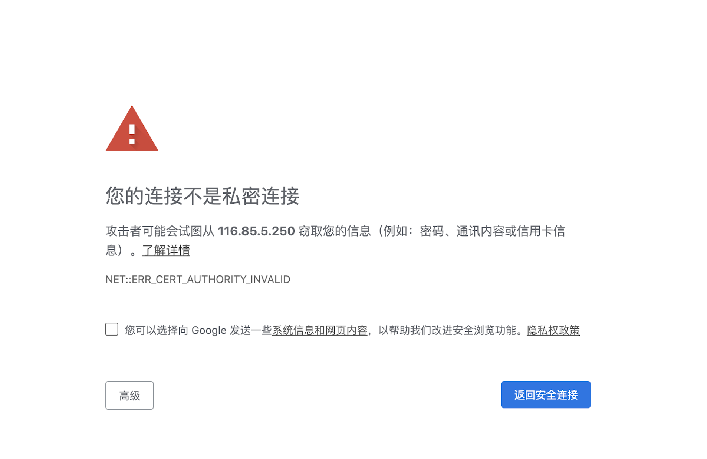

点击继续
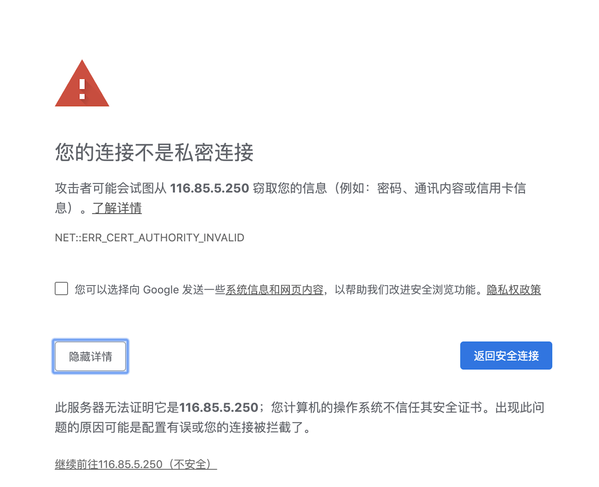

设置管理密码(超级管理员用户名默认为`admin`)


保存url地址
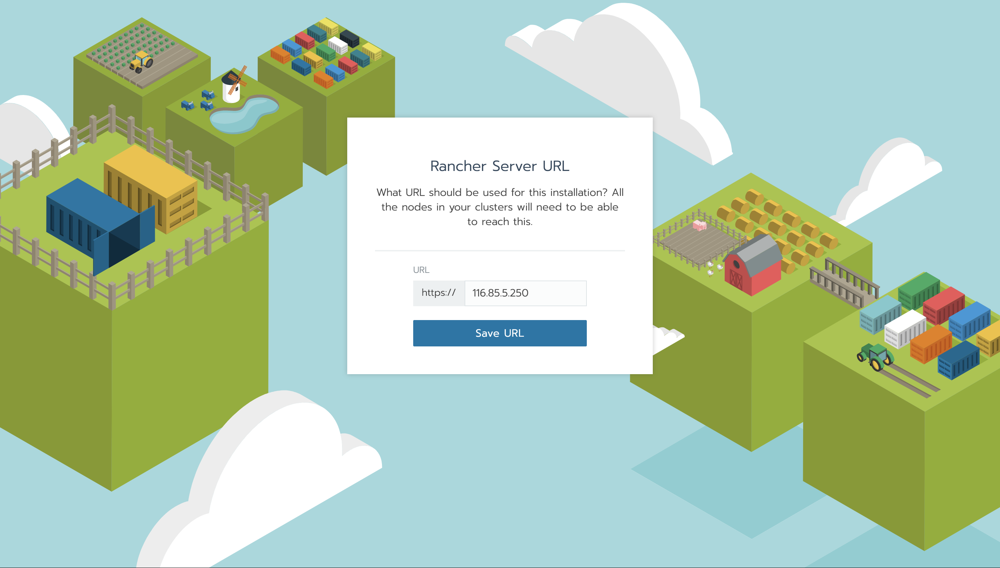

进入rancher server管理控制台
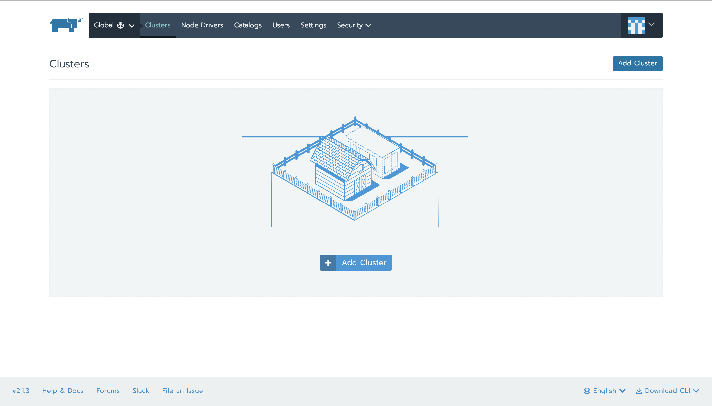


## 第四步：安装Etcd节点与控制节点
点击【Add Cluster】进入添加集群页面，设置集群名称:`k8s-cluster-rancher`，如下图

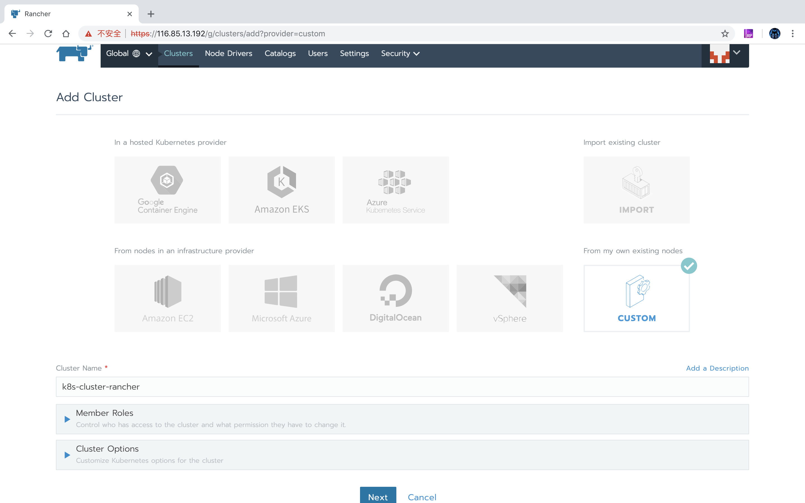

设置Etcd节点选项

* 【Node Options】-【Node Role】中只勾选【Etcd】
* 【Node Options】-【Node Address】-【Public Address】中天蝎Etcd云服务器的公网IP地址，如示例中的：`116.85.13.168`
* 【Node Options】-【Node Address】-【Internal Address】中天蝎Etcd云服务器的内网IP地址，如示例中的：`10.10.150.195`
* 【Node Options】-【Node Name】中填写Etcd云服务器的名称，如示例中的：`kubernetes-etc-x`

设置效果如下图：

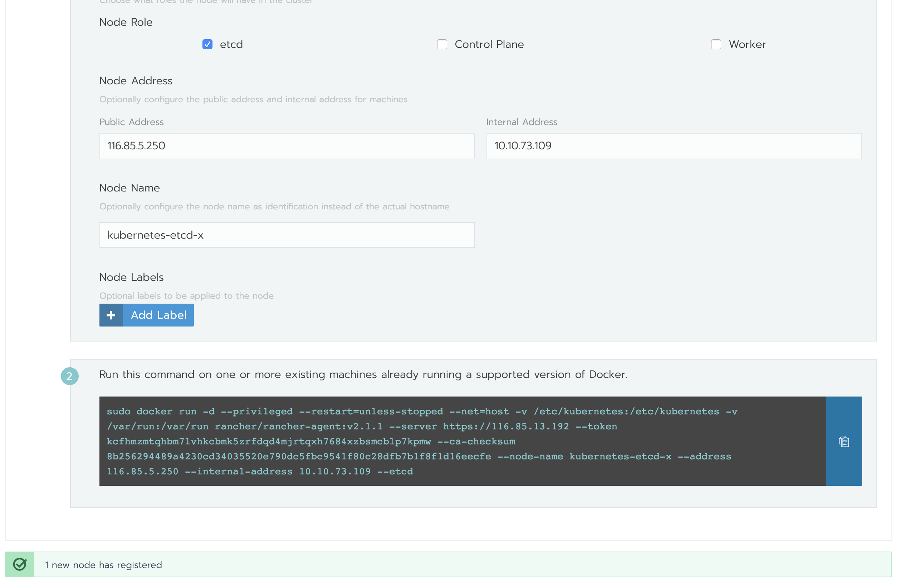

下方会自动生成Etcd节点的配置命令：
```
sudo docker run -d --privileged --restart=unless-stopped --net=host -v /etc/kubernetes:/etc/kubernetes -v /var/run:/var/run rancher/rancher-agent:v2.1.3 --server https://116.85.46.53 --token zs6zxddp7rdfxfvwhcpdw4vfxbfqccm2vg6hh7st2nwr9l9rtbk7j8 --ca-checksum 551014a641a7d23d0ed67153e2797b9fd8670307422cdfc232020cb831e376aa --node-name kubernetes-etc-x --address 116.85.13.168 --internal-address 10.10.150.195 --etcd

```

复制配置命令到Ectd云服务器终端并运行,输出如下：
```
OUTPUT

Unable to find image 'rancher/rancher-agent:v2.1.3' locally
v2.1.3: Pulling from rancher/rancher-agent
32802c0cfa4d: Pull complete 
da1315cffa03: Pull complete 
fa83472a3562: Pull complete 
f85999a86bef: Pull complete 
5bf53f7eb665: Pull complete 
b6dee6425e98: Pull complete 
15612bde45d1: Pull complete 
5bb137229af3: Pull complete 
72fc31ea0fd1: Pull complete 
Digest: sha256:c0c15e3fb32d516a16889765fe9ce62713617dc2f599a516c7d66620c737b705
Status: Downloaded newer image for rancher/rancher-agent:v2.1.3
ab7275fe95b6d2ffeb9c9090f642af311c71de5d4c2ca8e3d39163f4e52ad89c
```
Etcd节点安装完成后会自动连接到Rancher管理服务器，管理控制台底部会提示`1 new node has registered`。


同样的步骤安装控制节点：
* 【Node Options】-【Node Role】中只勾选【Control Plane】
* 【Node Options】-【Node Address】-【Public Address】中天蝎Etcd云服务器的公网IP地址，如示例中的：`116.85.60.45`
* 【Node Options】-【Node Address】-【Internal Address】中天蝎Etcd云服务器的内网IP地址，如示例中的：`10.10.0.89`
* 【Node Options】-【Node Name】中填写Control Plane云服务器的名称，如示例中的：`kubernetes-controller-x`

设置效果如下图：

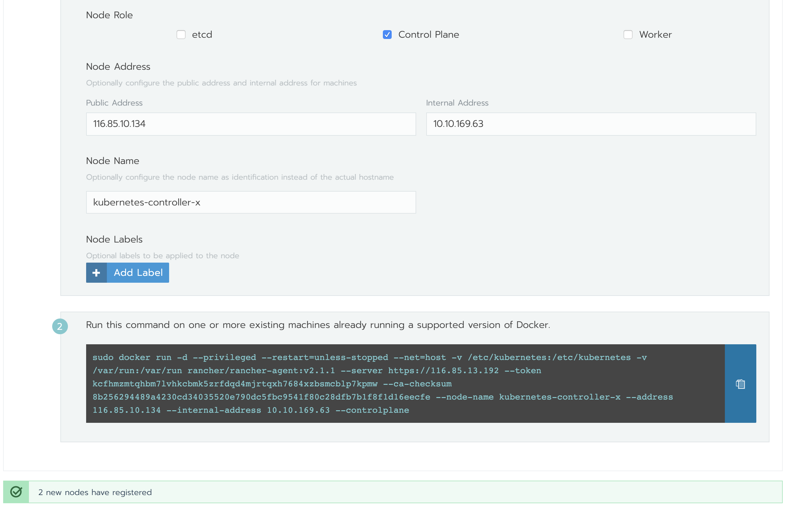

下方会自动生成Control Plane节点的配置命令：
```
sudo docker run -d --privileged --restart=unless-stopped --net=host -v /etc/kubernetes:/etc/kubernetes -v /var/run:/var/run rancher/rancher-agent:v2.1.3 --server https://116.85.46.53 --token zs6zxddp7rdfxfvwhcpdw4vfxbfqccm2vg6hh7st2nwr9l9rtbk7j8 --ca-checksum 551014a641a7d23d0ed67153e2797b9fd8670307422cdfc232020cb831e376aa --node-name kubernetes-controller-x --address 116.85.60.45 --internal-address 10.10.0.89 --controlplane

```

复制配置命令到Control Plane云服务器终端并运行,输出如下：
```
OUTPUT

Unable to find image 'rancher/rancher-agent:v2.1.1' locally
v2.1.1: Pulling from rancher/rancher-agent
473ede7ed136: Pull complete 
c46b5fa4d940: Pull complete 
93ae3df89c92: Pull complete 
6b1eed27cade: Pull complete 
f21f12a5ca08: Pull complete 
33a2b1a4bb51: Pull complete 
a0876ba0c412: Pull complete 
cbb664d29f0f: Pull complete 
bd32e23bc74b: Pull complete 
Digest: sha256:2236b44b39bf0c2ae2f5c158f2516e3c89c85f8fa664fa3315b3effe66e63395
Status: Downloaded newer image for rancher/rancher-agent:v2.1.1
bdd468b2552aba5db0e5bdd6b10d0f3b44872f0bbbe7292864dac69ea134ad4e
```
Control Plane节点安装完成后会自动连接到Rancher管理服务器，管理控制台底部会提示`2 new node has registered`


## 第五步：安装工作节点
重复**第四步**中的步骤安装**第一个工作节点**，详情如下：
* 【Node Options】-【Node Role】中只勾选【Worker】
* 【Node Options】-【Node Address】-【Public Address】中填写第一台工作节点云服务器的公网IP地址，如示例中的：`116.85.30.97`
* 【Node Options】-【Node Address】-【Internal Address】中填写第一台工作节点云服务器的内网IP地址，如示例中的：`10.10.232.55`
* 【Node Options】-【Node Name】中填写第一台工作节点云服务器的名称，如示例中的：`kubernetes-worker01-x`

设置效果如下图：

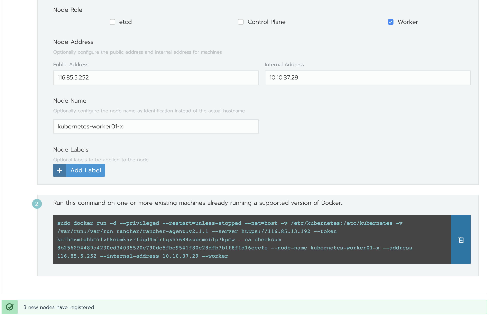

下方会自动生成工作节点的配置命令：
```
sudo docker run -d --privileged --restart=unless-stopped --net=host -v /etc/kubernetes:/etc/kubernetes -v /var/run:/var/run rancher/rancher-agent:v2.1.3 --server https://116.85.46.53 --token zs6zxddp7rdfxfvwhcpdw4vfxbfqccm2vg6hh7st2nwr9l9rtbk7j8 --ca-checksum 551014a641a7d23d0ed67153e2797b9fd8670307422cdfc232020cb831e376aa --node-name kubernetes-worker01-x --address 116.85.30.97 --internal-address 10.10.232.55 --worker

```

复制配置命令到`Worker1`云服务器终端并运行,输出如下：
```
OUTPUT
Unable to find image 'rancher/rancher-agent:v2.1.3' locally
v2.1.3: Pulling from rancher/rancher-agent
32802c0cfa4d: Pull complete 
da1315cffa03: Pull complete 
fa83472a3562: Pull complete 
f85999a86bef: Pull complete 
5bf53f7eb665: Pull complete 
b6dee6425e98: Pull complete 
15612bde45d1: Pull complete 
5bb137229af3: Pull complete 
72fc31ea0fd1: Pull complete 
Digest: sha256:c0c15e3fb32d516a16889765fe9ce62713617dc2f599a516c7d66620c737b705
Status: Downloaded newer image for rancher/rancher-agent:v2.1.3
5213acaac6a21cfa5770415755f924a53fa037aeb1163df50d3a8c9ed12d5c36
```
`Worker1`节点安装完成后会自动连接到Rancher管理服务器，管理控制台底部会提示`3 new node has registered`

重复如上步骤安装**第二个工作节点**，详情如下：
* 【Node Options】-【Node Role】中只勾选【Worker】
* 【Node Options】-【Node Address】-【Public Address】中填写第二台工作节点云服务器的公网IP地址，如示例中的：`116.85.37.60`
* 【Node Options】-【Node Address】-【Internal Address】中填写第二台工作节点云服务器的内网IP地址，如示例中的：`10.10.148.43`
* 【Node Options】-【Node Name】中填写第二台工作节点云服务器的名称，如示例中的：`kubernetes-worker02-x`

设置效果如下图：

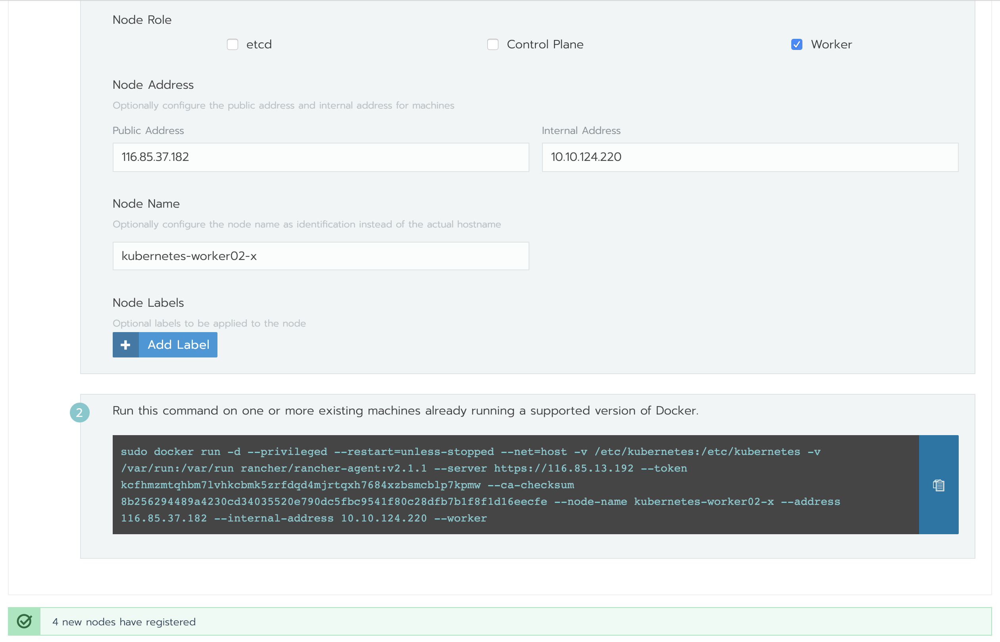

下方会自动生成工作节点的配置命令：
```
sudo docker run -d --privileged --restart=unless-stopped --net=host -v /etc/kubernetes:/etc/kubernetes -v /var/run:/var/run rancher/rancher-agent:v2.1.3 --server https://116.85.46.53 --token zs6zxddp7rdfxfvwhcpdw4vfxbfqccm2vg6hh7st2nwr9l9rtbk7j8 --ca-checksum 551014a641a7d23d0ed67153e2797b9fd8670307422cdfc232020cb831e376aa --node-name kubernetes-worker02-x --address 116.85.37.60 --internal-address 10.10.148.43 --worker

```

复制配置命令到`Worker2`云服务器终端并运行,输出如下：
```
OUTPUT

Unable to find image 'rancher/rancher-agent:v2.1.1' locally
v2.1.1: Pulling from rancher/rancher-agent
473ede7ed136: Pull complete 
c46b5fa4d940: Pull complete 
93ae3df89c92: Pull complete 
6b1eed27cade: Pull complete 
f21f12a5ca08: Pull complete 
33a2b1a4bb51: Pull complete 
a0876ba0c412: Pull complete 
cbb664d29f0f: Pull complete 
bd32e23bc74b: Pull complete 
Digest: sha256:2236b44b39bf0c2ae2f5c158f2516e3c89c85f8fa664fa3315b3effe66e63395
Status: Downloaded newer image for rancher/rancher-agent:v2.1.1
909549bc0d6035a9df4d68cbe51406da76c3e17e1d633d541dca0c82a06dc69d
```
`Worker2`节点安装完成后会自动连接到Rancher管理服务器，管理控制台底部会提示`4 new node has registered`

至此，Kubernetes集群所有节点均已成功安装，点击【Done】完成集群设置即可。

## 第六步：查看集群


## 结论
