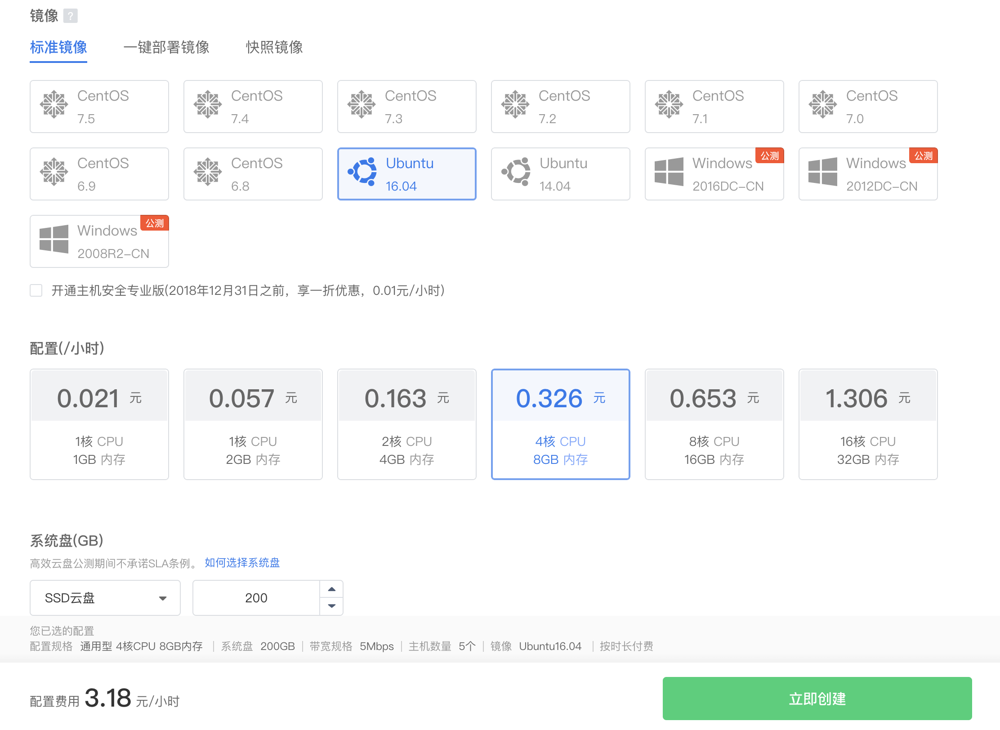

# 如何在Ubuntu 16.04上使用Rancher创建Kubernetes 1.11集群

## 介绍

## 目标

## 第一步：购买滴滴云服务器
登陆[滴滴云控制台](https://app.didiyun.com/#/auth/signin?channel=0&return_to=https%3A%2F%2Fwww.didiyun.com%2F)购买**5台**滴滴云服务器(如果需要完成试验后即删除可以购买按时长配置)，配置推荐至少2核CPU、4GB内存、40GB存储、2M带宽，5台服务器作用如下：
* Rancher节点：1台。
* Etcd节点：1台。
* 控制节点：1台。
* 工作节点：2台。

登陆滴滴云批量创建云服务器，如下图：

> 备注：本文实验配置均为4核CPU、8GB内存、200GB存储、5M带宽。

## 第二步：安装Docker

## 第三步：安装rancher

## 第四步：安装Etcd节点与控制节点

## 第五步：安装工作节点

## 第六步：查看集群

## 结论
